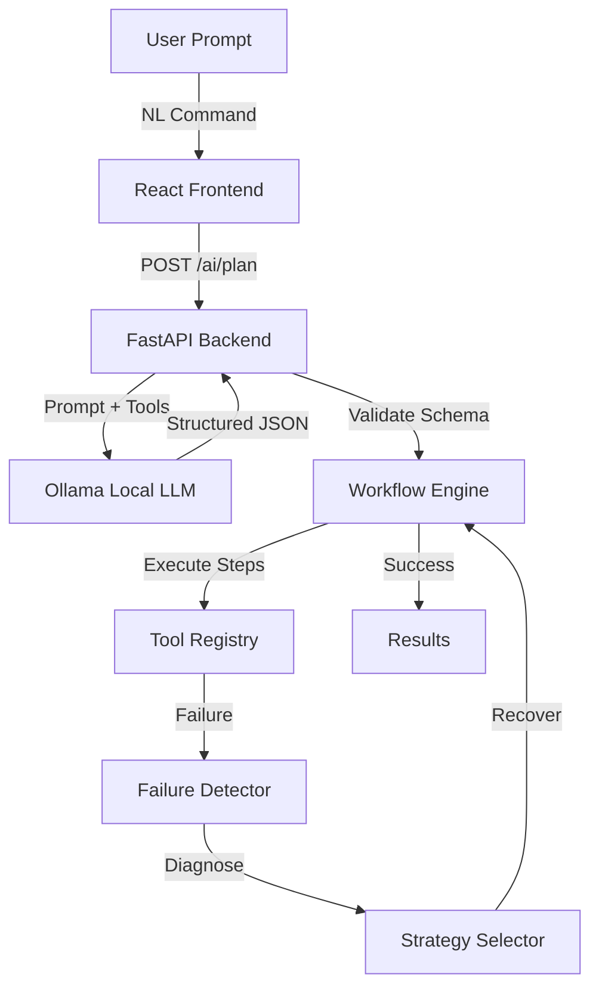

# FlowMind

FlowMind is a self-learning AI Workflow Orchestrator designed to automate developer and operational tasks utilizing local LLMs.

## 🚀 Features

- **Natural Language Planning**: Describe your task, and FlowMind's local LLM (Ollama) generates a structured multi-step automation workflow.
- **Self-Healing Execution**: If a step fails, the backend engine pauses, diagnoses the issue, devises a recovery strategy, and automatically retries.
- **Custom Visual Engine**: A beautifully styled React Flow graph visualizes triggers, AI processing steps, and conditional tool executions.
- **Live Telemetry**: Real-time polling monitors the execution pipeline, tracking step successes, failures, and recovery events.

## 🏗 Architecture



## 🛠 Tech Stack

- **Frontend**: React 19, TypeScript, Vite, TailwindCSS, React Flow, Recharts
- **Backend**: Python, FastAPI, SQLAlchemy
- **AI**: Ollama (qwen3:8b)
- **Database**: SQLite (Configured for PostgreSQL)

## 📦 Installation & Setup

1. **Install Ollama**
   Download and install [Ollama](https://ollama.com/), then pull the required model:
   ```bash
   ollama run qwen3:8b
   ```

2. **Backend Setup**
   ```bash
   cd backend
   python -m venv venv
   source venv/bin/activate  # On Windows: .\venv\Scripts\activate
   pip install -r requirements.txt
   uvicorn app.main:app --reload --host 0.0.0.0 --port 8000
   ```

3. **Frontend Setup**
   ```bash
   cd frontend
   npm install
   npm run dev
   ```

## 🔐 Environment Variables

Create a `.env` file in the root directory based on `.env.example`:

```env
AI_PROVIDER=ollama
OLLAMA_BASE_URL=http://localhost:11434
OLLAMA_MODEL=qwen3:8b
JWT_SECRET_KEY=your_secret_key
DATABASE_URL=sqlite:///./flowmind.db
```

## 🧠 Security Model
FlowMind enforces an **Approval Gate** mechanism for high-risk actions (e.g., sending emails). The LLM cannot execute arbitrary shell or Python code. It is restricted strictly to registered tool interfaces defined in `app/tools/registry.py`.

## 🐳 Docker (Optional)
You can run the entire stack (Frontend, Backend) via Docker Compose:
```bash
docker compose up -d --build
```
*Note: Ensure Ollama is running natively on your host machine to utilize hardware acceleration.*

## 🧪 Testing
The API can be tested via the interactive Swagger documentation at `http://localhost:8000/docs`.

## 📜 License
MIT License
