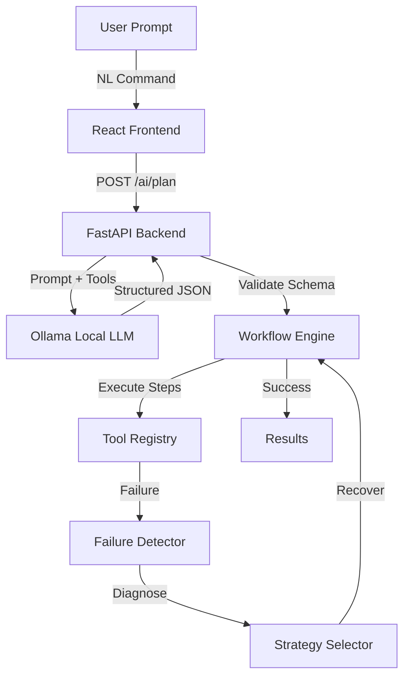

# FlowMind
## Self-Learning AI Workflow Orchestrator

FlowMind is a self-learning AI Workflow Orchestrator designed to automate developer and operational tasks by utilizing local LLMs to generate structured pipelines from natural language prompts.

### Key Features
- Local Ollama-powered workflow planning
- Natural-language → executable workflow generation
- Custom workflow orchestration engine
- React Flow visualization
- Tool registry
- Failure detection and recovery
- ML-based workflow intelligence
- Human approval gates
- Execution telemetry

### Architecture



### Tech Stack
- **Frontend**: React 19, TypeScript, Vite, TailwindCSS, React Flow, Recharts
- **Backend**: Python, FastAPI, SQLAlchemy
- **AI**: Ollama (qwen3:8b)
- **Database**: SQLite (Configured for PostgreSQL)

### Screenshots
*(Screenshots coming soon)*

### How it Works
1. **Planning**: The user submits a natural language request. The FastAPI backend sends this prompt and the available Tool Registry schemas to the local Ollama LLM.
2. **Parsing**: The LLM returns a structured JSON execution graph, which is validated using Pydantic.
3. **Execution**: The Workflow Engine executes the steps sequentially or in parallel based on step dependencies.
4. **Self-Healing**: If a tool step fails, a Recovery Engine pauses execution, attempts a diagnostic fix, and retries the step or pauses for Human Approval.

### Installation

1. **Clone the repository**
```bash
git clone https://github.com/BalaAdithyaS/FlowMind.git
cd FlowMind
```

2. **Environment Variables**
Create a `.env` file in the root based on `.env.example`:
```env
AI_PROVIDER=ollama
OLLAMA_BASE_URL=http://localhost:11434
OLLAMA_MODEL=qwen3:8b
JWT_SECRET_KEY=your_secret_key
DATABASE_URL=sqlite:///./flowmind.db
```

3. **Backend Setup**
```bash
cd backend
python -m venv venv
source venv/bin/activate  # On Windows: .\venv\Scripts\activate
pip install -r requirements.txt
```

4. **Frontend Setup**
```bash
cd frontend
npm install
```

### Ollama Setup
Download and install [Ollama](https://ollama.com/), then pull the required model:
```bash
ollama run qwen3:8b
```
Ensure Ollama is running (`http://localhost:11434`) before starting the backend.

### Running the Project
**Terminal 1 (Backend):**
```bash
cd backend
source venv/bin/activate
uvicorn app.main:app --reload --host 0.0.0.0 --port 8000
```

**Terminal 2 (Frontend):**
```bash
cd frontend
npm run dev
```

### Demo Workflow
Navigate to `http://localhost:5173`. Go to the **Create Workflow** page and type:
*"Send a welcome email to new user and create a calendar event."*
The engine will visualize the generated plan using React Flow and allow you to execute it.

### Project Structure
```text
FlowMind/
├── backend/
│   ├── app/
│   │   ├── api/          # API endpoints
│   │   ├── tools/        # Tool registry and implementations
│   │   ├── workflow/     # Custom workflow orchestration engine
│   │   ├── recovery/     # Self-healing logic
│   │   └── models/       # Database models
├── frontend/
│   ├── src/
│   │   ├── pages/        # React views (Command Center, Creator, etc.)
│   │   ├── components/   # React Flow nodes, Monitor components
│   │   └── index.css     # Global styles
├── docs/                 # Engineering audits and documentation
└── docker-compose.yml
```

### Current Implementation Status

| Feature | Status | Notes |
|---------|--------|-------|
| UI / Design System | ✅ Implemented | Production-ready React frontend |
| Ollama Planning | ✅ Implemented | Full JSON structured generation working |
| Workflow Engine | ⚠️ Prototype | Basic execution works, but runs in-memory |
| React Flow Visualizer | ✅ Implemented | Custom nodes and edges render perfectly |
| Execution Telemetry | ✅ Implemented | Live polling tracks timeline states |
| Self-Healing | ⚠️ Prototype | Basic simulated detection/retries exist |
| Tool Integrations | 🟡 Mock/Demo | Tools exist but simulate API responses |
| Database Persistence | ❌ Planned | SQLAlchemy models exist but aren't wired |
| ML Telemetry | 🟡 Mock/Demo | Dashboard exists but uses synthetic data |

### Future Roadmap
- Connect the SQLAlchemy models to a PostgreSQL database for full workflow persistence.
- Implement real API connections for GitHub, Gmail, and Calendar tools.
- Train real Scikit-Learn intent classification models on execution telemetry.
- Upgrade frontend polling to WebSockets for instant execution feedback.
